没有 SLAM，虚拟现实将永远停留在座椅上。

# 第2讲　初识SLAM

1. 我在什么地方？——定位。
2. 周围环境是什么样？——建图。

当谈论视觉 SLAM 时，我们主要是指如何用相机解决定位和建图问题。

## 单目相机

近处的物体移动快，远处的物体则运动缓慢。于是，当相机移动时，这些物体在图像上的运动就形成了视差。通过视差，我们就能定量地判断哪些物体离得远，哪些物体离得近。

如果把相机的运动和场景大小同时放大两倍，单目相机所看到的像是一样的。同样地，把这个大小乘以任意倍数，我们都将看到一样的景象。这说明，单目SLAM估计的轨迹和地图将与真实的轨迹和地图相差一个因子，也就是所谓的尺度（Scale）。由于单目SLAM无法仅凭图像确定这个真实尺度，所以又称为尺度不确定性。

平移之后才能计算深度，以及无法确定真实尺度，这两件事情给单目SLAM的应用造成了很大的麻烦。其根本原因是通过单张图像无法确定深度。所以，为了得到这个深度，人们开始使用双目和深度相机。

## 双目相机和深度相机

### 双目相机

双目相机由两个单目相机组成，但这两个相机之间的距离〔称为基线（Baseline）〕是已知的。我们通过这个基线来估计每个像素的空间位置——这和人眼非常相似。我们人类可以通过左右眼图像的差异判断物体的远近，在计算机上也是同样的道理。

双目相机测量到的深度范围与基线相关。基线距离越大，能够测量到的就越远。

双目或多目相机的缺点是配置与标定均较为复杂，其深度量程和精度受双目的基线与分辨率限制，而且视差的计算非常消耗计算资源，需要使用 GPU 和 FPGA 设备加速后，才能实时输出整张图像的距离信息。因此在现有的条件下，计算量是双目的主要问题之一。

### 深度相机

深度相机（RGB-D 相机）通过主动向物体发射光并接收返回的光，测出物体离相机的距离。这部分并不像双目那样通过软件计算来解决，而是通过物理的测量手段，所以相比于双目可节省大量的计算量。

不过，现在多数 RGB-D 相机还存在测量范围窄、噪声大、视野小、易受日光干扰、无法测量透射材质等诸多问题，在 SLAM 方面，主要用于室内 SLAM，室外则较难应用。

## 经典视觉 SLAM 框架

1. 传感器信息读取
2. 视觉里程计(Visual Odometry, VO)
	- 视觉里程计关心相邻图像之间的相机运动，最简单的情况当然是两张图像之间的运动关系。
	- 仅通过视觉里程计来估计轨迹，将不可避免地出现累计漂移(Accumulating Drift)。
	- 还需要两种技术:后端优化x和回环检测。回环检测负责把“机器人回到原始位置”的事情检测出来，而后端优化则根据该信息，校正整个轨迹的形状。
3. 后端优化(Optimization)
	- 在视觉 SLAM 中，前端和计算机视觉研究领域更为相关，比如图像的特征提取与匹配等，后端则主要是滤波与非线性优化算法。
4. 回环检测(Loop Closing)
	- 又称闭环检测(Loop Closure Detection)，主要解决位置估计随时间漂移的问题。
	- 我们可以判断图像间的相似性，来完成回环检测。如果回环检测成功，可以显著地减小累积误差。
5. 建图(Mapping)
	- 度量地图(Metric Map)
		- 度量地图强调精确地表示地图中物体的位置关系。
	- 拓扑地图(Topological Map)
		- 拓扑地图更强调地图元素之间的关系。拓扑地图是一个图(Graph)，由节点和边组成，只考虑节点间的连通性，例如 A，B 点是连通的，而不考虑如何从 A 点到达 B 点的过程。

如果把工作环境限定在静态、刚体，光照变化不明显、没有人为干扰的场景，那么，这个 SLAM 系统是相当成熟的了。

## SLAM 问题的数学表述

- 运动方程：x_k = f (x_{k−1},u_k,w_k)
- 观测方程：z_{k,j} = h (y_j,x_k,v_{k,j})

> 我们按照运动和观测方程是否为线性，噪声是否服从高斯分布进行分类，分为线性/非线性和高斯/非高斯系统。其中线性高斯系统(Linear Gaussian, LG 系统)是最简单的，它的无偏的最优估计可以由卡尔曼滤波器(Kalman Filter, KF)给出。而在复杂的非线性非高斯系统(Non-Linear Non-Gaussian，NLNG 系统)中，我们会使用以扩展卡尔曼滤波器(Extended Kalman Filter, EKF)和非线性优化两大类方法去求解它。

---

# 第二讲 三维刚体运动

视觉 SLAM 的基本问题之一:一个刚体在三维空间中的运动是如何描述的。

## 旋转矩阵

相机运动是一个刚体运动，它保证了同一个向量在各个坐标系下的长度和夹角都不会发生变化。这种变换称为欧氏变换。这样一个欧氏变换由一个旋转和一个平移两部分组成。

旋转矩阵有一些特别的性质。事实上，它是一个行列式为 1 的正交矩阵x。反之，行列式为 1 的正交矩阵也是一个旋转矩阵。所以，我们可以把旋转矩阵的集合定义如下:

> SO(n)={R∈R^n×n|RR^T =I,det(R)=1}.

SO(n) 是特殊正交群(Special Orthogonal Group)的意思。

反向变换为：R^-1 = R^T

引入齐次坐标：使变换关系为线性。变换矩阵为旋转矩阵和平移矩阵的和。

> 这是一个数学技巧：我们把一个三维向量的末尾添加 1，变成了四维向量，称为齐次坐标。对于这个四维向量，我们可以把旋转和平移写在一个矩阵里面，使得整个关系变成了线性关系。

变换矩阵 T 构成特殊欧氏群(Special Euclidean Group)：

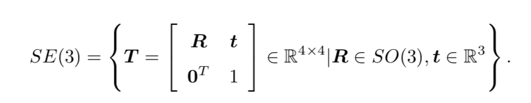

其反向变换为：

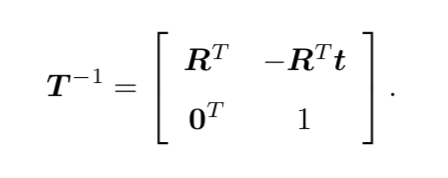

```
（矩阵库）Eigen 实例：brew install eigen（in MacOS）
```

## 旋转向量、欧拉角和四元数

### 旋转向量

矩阵表示方式至少有以下几个缺点:

1. SO(3) 的旋转矩阵有九个量，但一次旋转只有三个自由度。因此这种表达方式是冗余的。同理，变换矩阵用十六个量表达了六自由度的变换。
2. 旋转矩阵自身带有约束：它必须是个正交矩阵，且行列式为 1。变换矩阵也是如此。当我们想要估计或优化一个旋转矩阵/变换矩阵时，这些约束会使得求解变得更困难。

使用三维向量表达旋转，六维向量表达变换：旋转向量（旋转轴+旋转角）+平移向量

由旋转向量到旋转矩阵的过程由罗德里格斯公式(Rodrigues’s Formula )表明。

### 欧拉角

1. 绕物体的 Z 轴旋转，得到偏航角 yaw;
2. 绕旋转之后的 Y 轴旋转，得到俯仰角 pitch;
3. 绕旋转之后的 X 轴旋转，得到滚转角 roll。

欧拉角的一个重大缺点是会碰到著名的万向锁问题(Gimbal Lockx):在俯仰角为 ±90◦ 时，第一次旋转与第三次旋转将使用同一个轴，使得系统丢失了一个自由度(由三次旋转变成了两次旋转)。这被称为奇异性问题，在其他形式的欧拉角中也同样存在。理论上可以证明，只要我们想用三个实数来表达三维旋转时，都会不可避免地碰到奇异性问题。由于这种原理，欧拉角不适于插值和迭代，往往只用于人机交互中。

### 四元数

旋转矩阵用九个量描述三自由度的旋转，具有冗余性;欧拉角和旋转向量是紧凑的，但具有奇异性。事实上，我们找不到不带奇异性的三维向量描述方式。

- 单位四元数能够表达三维空间的旋转。
- 任意的旋转都可以由两个互为相反数的四元数表示。

用四元数表示旋转：(p 点绕轴 n 旋转θ)

1. p = \[0,x,y,z\] = \[0,v\].
2. q = \[cos θ/2,nsin θ/2\].
3. p′= qpq^−1.

- 四元数和旋转矩阵的转换：

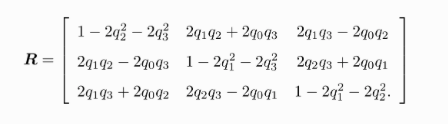

## 相似、仿射和射影变换

欧氏 变换保持了向量的长度和夹角，相当于我们把一个刚体原封不动地进行了移动或旋转，不改变它自身的样子。而其他几种变换则会改变它的外形：

1. 相似变换
	- 相似变换比欧氏变换多了一个自由度，它允许物体进行均匀的缩放。
2. 仿射变换
	- 仿射变换只要求旋转矩阵是一个可逆矩阵，而不必是正交矩阵。仿射变换也叫正交投影。经过仿射变换之后，立方体就不再是方的了，但是各个面仍然是平行四边形。
3. 射影变换
	- 左上角为可逆矩阵 A，右上为平移 t，左下缩放 aT 。由于采用齐坐标，当 v ̸= 0 时，我们可以对整个矩阵除以 v 得到一个右下角为 1 的矩阵;否则，则得到右下角为 0 的矩阵。因此，2D 的射影变换一共有 8 个自由度，3D 则共有 15 个自由度。射影变换是现在讲过的变换中，形式最为一般的。从真实世界到相机照片的变换可以看成一个射影变换。读者可以想象一个原本方形的地板砖，在照片当中是什么样子:首先，它不再是方形的。由于近大远小的关系，它甚至不是平行四边形，而是一个不规则的四边形。

- 常见变换性质比较

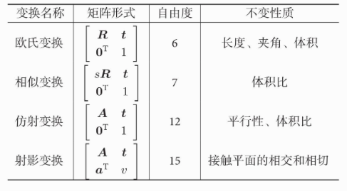

**从真实世界到相机照片的变换是一个射影变换。如果相机的焦距为
无穷远，那么这个变换则为仿射变换**。

**T_{wc} 的位移向量就是相机的世界坐标：p_w = T_{wc}0 = t_wc**.

```
Eigen 实例：变换
Pangolin 实例：可视化（Pangolin是对OpenGL进行封装的轻量级的OpenGL输入/输出和视频显示的库。）
```

---

# 李群与李代数

在 SLAM 中位姿是未知的，而我们需要解决什么样的相机位姿最符合当前观测数据这样的问题。一种典型的方式是把它构建成一个优化问题，求解最优的 R, t，使得误差最小化。

## 李群与李代数基础

旋转矩阵自身是带有约束的(正交且行列式为 1)。它们作为优化变量时，会引入额外的约束，使优化变得困难。通过李群——李代数间的转换关系，我们希望把位姿估计变成无约束的优化问题，简化求解方式。

旋转或变换的集合都只对乘法封闭。对于这种只有一个运算的集合，我们把它叫做群。一个是特殊正交群 SO(3)，也就是旋转矩阵群，还有特殊欧氏群 SE(3)，也就是变换矩阵群，

李群是指具有连续(光滑)性质的群。SO(3) 和 SE(3) 都是李群。

**李代数的引出，略**

- [SLAM 为什么需要李群与李代数](https://mp.weixin.qq.com/s/sVjy9kr-8qc9W9VN78JoDQ)

R(t) = exp(φ0∧ · t)，这个式子只在t 附近有效。

当某个时刻的 R 已知时，存在一个向量 φ ，二者满足这个矩阵指数关系。而这个 φ ，就是对应到 SO(3) 上的李代数 so(3)。

每个李群都有与之对应的李代数。李代数描述了李群的局部性质。

## 指数与对数映射

### 指数映射

- R'(t) = φ0∧ · R(t)
- R(t) = exp(φ0∧ · t)

李代数小 so(3) 是三维向量 φ 的集合，每个向量 φi 的反对称矩阵都可以表达李群(大 SO(3))上旋转矩阵 R 的导数，而 R 和 φ 是一个指数映射关系。也就是说，李群空间的任意一个旋转矩阵 R 都可以用李代数空间的一个向量的反对称矩阵指数来近似。

小 so(3) 的李代数空间就是由旋转向量组成的的空间，其物体意义就是旋转向量。而其指数映射关系就是罗德里格斯公式，

### 对数映射

反过来，用对数映射也能把大 SO(3) 李群空间中元素映射到小 so(3) 李代数空间中去。

- SO(3), SE(3), so(3), se(3) 的对应关系：

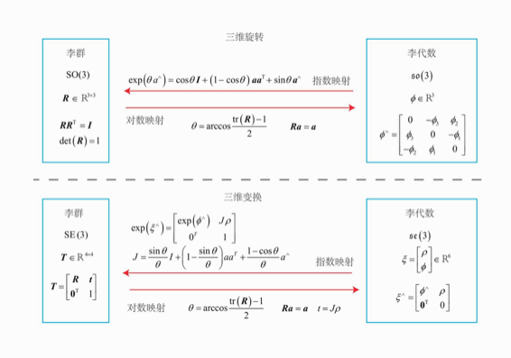

## 李代数求导与扰动模型

我们经常会构建与位姿有关的函数，然后讨论该函数关于位姿的导数，以调整当前的估计值。然而，SO(3), SE(3)上并没有良好定义的加法，它们只是群。如果我们把T 当成一个普通矩阵来处理优化，那就必须对它加以约束。而从李代数角度来说，由于李代数由向量组成，具有良好的加法运算。因此，使用李代数解决求导问题的思路分为两种：

1. 用李代数表示姿态，然后根据李代数加法来对李代数求导。
2. 对李群左乘或右乘微小扰动，然后对该扰动求导，称为左扰动和右扰动模型。

第一种方式对应到李代数的求导模型，而第二种则对应到扰动模型。确实实际SLAM问题中，扰动模型比较实用方便。

## 相似变换群与李代数

我们已经介绍过单目的尺度不确定性。如果在单目 SLAM 中使用 SE(3) 表示位姿，那么由于尺度不确定性与尺度漂移，整个 SLAM 过程中的尺度会发生变化，这在 SE(3) 中未能体现出来。因此，在单目情况下我们一般会显式地把尺度因子表达出来。用数学语言来说，对于位于空间的点 p，在相机坐标系下要经过一个相似变换，而非欧氏变换。

```
(李代数库)Sophus：使用非模板类的老版本
```

---

# 相机与图像

## 相机模型

### 针孔相机模型

像素坐标系与成像平面之间，相差了一个缩放和一个原点的平移。

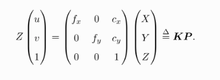

我们把中间的量组成的矩阵称为相机的内参数矩阵(Camera Intrinsics)K。通常认为，相机的内参在出厂之后是固定的，不会在使用过程中发生变化。有的相机生产厂商会告诉你相机的内参，而有时需要你自己确定相机的内参，也就是所谓的标定。

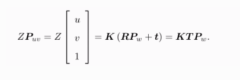

相机的位姿 R, t 又称为相机的外参数(Camera Extrinsics)。相比于不变的内参，外参会随着相机运动发生改变，同时也是 SLAM
 中待估计的目标，代表着机器人的轨迹。

### 畸变

为了获得好的成像效果，我们在相机的前方加了透镜。透镜的加入对成像过程中光线的传播会产生新的影响：一是透镜自身的形状对光线传播的影响，二是在机械组装过程中，透镜和成像平面不可能完全平行，这也会使得光线穿过透镜投影到成像面时的位置发生变化。

由透镜形状引起的畸变称之为**径向畸变**。

> 在针孔模型中，一条直线投影到像素平面上还是一条直线。可是，在实际拍摄的照片中，摄像机的透镜往往使得真实环境中的一条直线在图片中变成了曲线x。越靠近图像的边缘，这种现象越明显。由于实际加工制作的透镜往往是中心对称的，这使得不规则的畸变通常径向对称。它们主要分为两大类，桶形畸变和枕形畸变。桶形畸变是由于图像放大率随着离光轴的距离增加而减小，而枕形畸变却恰好相反。在这两种畸变中，穿过图像中心和光轴有交点的直线还能保持形状不变。

在相机的组装过程中由于不能使得透镜和成像面严格平行也会引入**切向畸变**。

对于相机坐标系中的一点 P (X, Y, Z)，我们能够通过五个畸变系数找到这个点在像素平面上的正确位置:

1. 将三维空间点投影到归一化图像平面。设它的归一化坐标为\[x, y\]T。
2. 对归一化平面上的点进行径向畸变和切向畸变纠正。

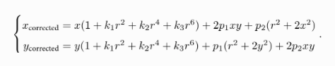

3. 将纠正后的点通过内参数矩阵投影到像素平面，得到该点在图像上的正确位置

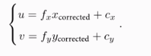

实际应用中，可以灵活选择纠正模型，比如只选择 k1, p1, p2 这三项等。

单目相机的成像过程:

1. 首先，世界坐标系下有一个固定的点 P，世界坐标为 Pw;
2. 由于相机在运动，它的运动由 R, t 或变换矩阵 T ∈ SE(3) 描述。P 的相机坐标为: P_c = R · P_w + t 。
3. 这时的 P_c 仍有 X, Y, Z 三个量，把它们投影到归一化平面 Z = 1 上，得到 P 的归 一化相机坐标:Pc = \[X/Z,Y/Z,1\] T。
4. 最后，P 的归一化坐标经过内参后，对应到它的像素坐标:P_uv = K · P_c。

综上所述，一共谈到了四种坐标:世界、相机、归一化相机和像素坐标。它反映了整个成像的过程。

### 双目相机模型

在左右双目的相机中，我们可以把两个相机都看作针孔相机。它们是水平放置的，意味两个相机的光圈中心都位于 x 轴上。它们的距离称为双目相机的基线(Baseline, 记作 b)，是双目相机的重要参数。

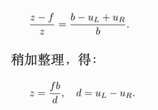

这里 d 为左右图的横坐标之差，称为视差(Disparity)。根据视差，我们可以估计一个像素离相机的距离。视差与距离成反比：视差越大，距离越近。同时，由于视差最小为一个像素，于是双目的深度存在一个理论上的最大值，由 f b 确定。我们看到，当基线越长时，双目最大能测到的距离就会变远；反之，小型双目器件则只能测量很近的距离。

> 虽然由视差计算深度的公式很简洁，但视差 d 本身的计算却比较困难。我们需要确切地知道左眼图像某个像素出现在右眼图像的哪一个位置(即对应关系)，这件事亦属于“人类觉得容易而计算机觉得困难”的事务。当我们想计算每个像素的深度时，其计算量与精度都将成为问题，而且只有在图像纹理变化丰富的地方才能计算视差。

### RGB-D 相机模型

在测量深度之后，RGB-D 相机通常按照生产时的各个相机摆放位置，自己完成深度与彩色图像素之间的配对，输出一一对应的彩色图和深度图。我们可以在同一个图像位置，读取到色彩信息和距离信息，计算像素的 3D 相机坐标，生成点云(Point Cloud)。对 RGB-D 数据，既可以在图像层面进行处理，亦可在点云层面处理。

```
opencv 操作图像实例(brew install opencv, brew link --overwrite opencv)
opencv+PCL 拼接点云实例(brew install pcl)

cp /usr/local/Cellar/pcl/1.9.1_4/pcl_viewer.app/Contents/MacOS/pcl_viewer /usr/local/bin
or
ln -s /usr/local/Cellar/pcl/1.9.1_4/pcl_viewer.app/Contents/MacOS/pcl_viewer /usr/local/bin/pcl_viewer
```

计算位于(u,v)，深度为d的像素，在相机坐标系下的位置。并根据外参把它们变换到世界坐标。其中相机坐标计算方法如下：

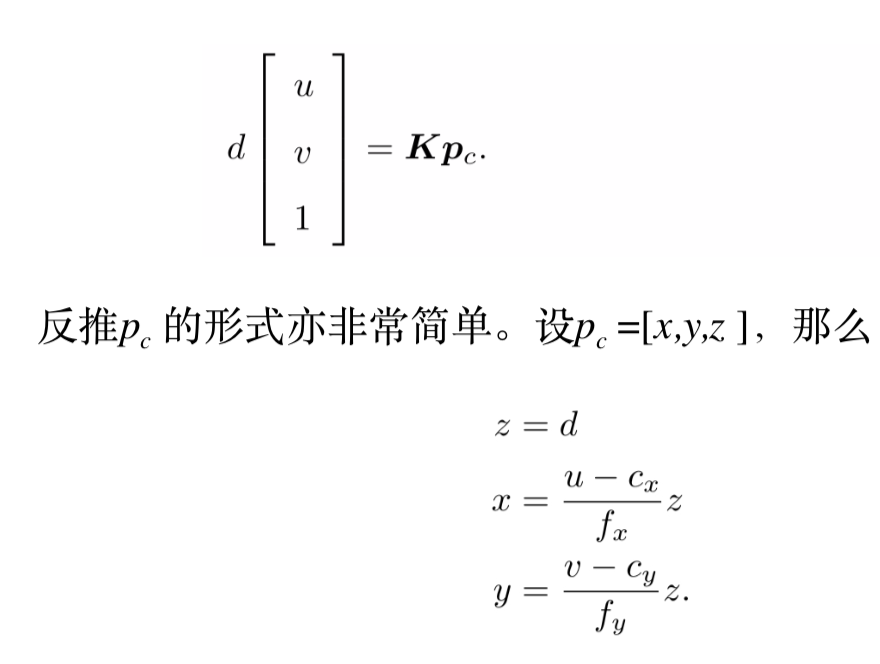

---

# 非线性优化

## 状态估计问题

直接求后验分布是困难的，但是求一个状态最优估计，使得在该状态下，后验概率最大化(Maximize a Posterior，MAP)，则是可行的。

“在什么样的状态下，最可能产生现在观测到的数据”。这就是最大似然估计的直观意义。

假设噪声项为正态分布，由此求得的观测数据的条件概率也是正态分布。我们往往使用最小化负对数的方式，来求一个高斯分布的最大似然。这就得到了一个总体意义下的最小二乘问题(Least Square Problem)。它的最优解等价于状态的最大似然估计。

## 非线性最小二乘

将目标函数在 x 附近进行泰勒展开。

### 牛顿法

- 保留一阶梯度：最速下降法
    - 过于贪心，易增加迭代次数
- 保留二阶梯度：牛顿法
    - 需要计算 Hessian 矩阵

### 高斯牛顿法(Gauss-Newton)

将 f(x) 进行一阶的泰勒展开（注意不是目标函数 f(x)^2 )，这样只需求解一个线性的最小二乘问题。

使用 J^T · J 作为 Hessian 矩阵的近似。

### 列文伯格-马夸尔特方法(Levernberg-Marquardt)

由于 Gauss-Newton 方法中采用的近似二阶泰勒展开只能在展开点附近有较好的近似效果，所以我们很自然地想到应该给 ∆x 添加一个信赖区域(Trust Region
)，不能让它太大而使得近似不准确。非线性优化中有一系列这类方法，这类方法也被称之为信赖区域方法(Trust Region Method)。在信赖区域里边，我们认为近似是有效的；出了这个区域，近似可能会出问题。

使用

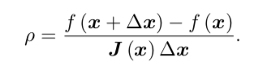

来判断泰勒近似是否够好。ρ 的分子是实际函数下降的值，分母是近似模型下降的值。如 果 ρ 接近于 1，则近似是好的。如果 ρ 太小，说明实际减小的值远少于近似减小的值，则认为近似比较差，需要缩小近似范围。反之，如果 ρ 比较大，则说明实际下降的比预计的更大，我们可以放大近似范围。

### 初始值

无论是 G-N 还是 L-M
，在做最优化计算的时候，都需要提供变量的初始值。由于目标函数太复杂，导致在求解空间上的变化难以琢磨，对问题提供不同的初始值往往会导致不同的计算结果。这种情况是非线性优化的通病：大多数算法都容易陷入局部极小值。因此，无论是哪类科学问题，我们提供初始值都应该有科学依据，例如视觉 SLAM 问题中，我们会用 ICP，PnP 之类的算法提供优化初始值。

```
Ceres 实例（brew install ceres-solver）：Ceres 面向通用的最小二乘问题的求解。
g2o 实例：图优化库（brew install brewsci/science/g2o）
```

---

# References

- [从零开始学习 SLAM]()
    - [为什么要学 SLAM](https://mp.weixin.qq.com/s?__biz=MzIxOTczOTM4NA==&mid=2247485792&idx=1&sn=358b9bea94cf31b976abc3c12b28f4d7&chksm=97d7ecf7a0a065e1664469c22adce35e6d919d74f5ab95693c8921241f3fefe37fb571527e10&scene=21#wechat_redirect)
- [SLAM 入门之视觉里程计](https://www.cnblogs.com/wangguchangqing/category/1134664.html)


